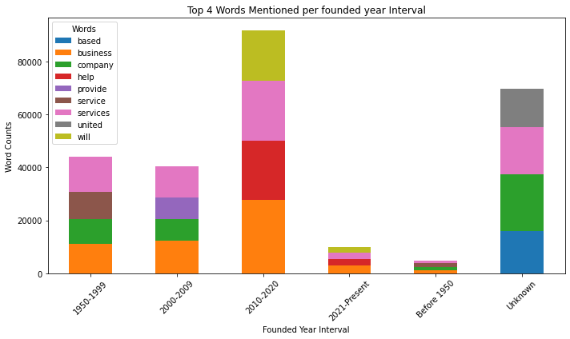
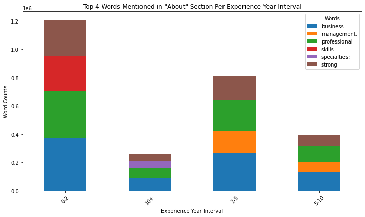
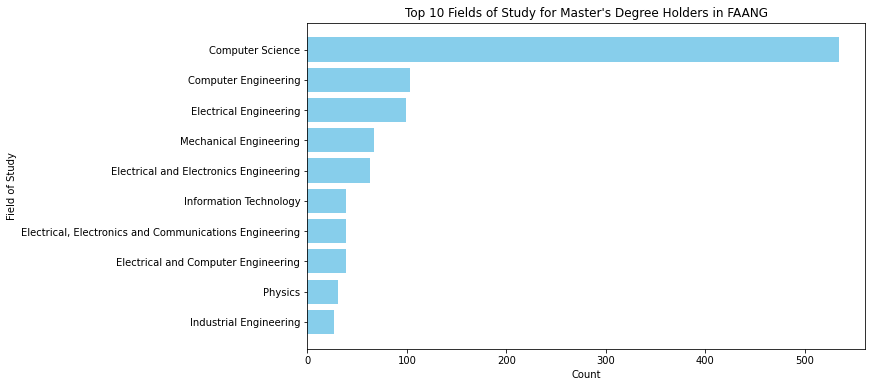
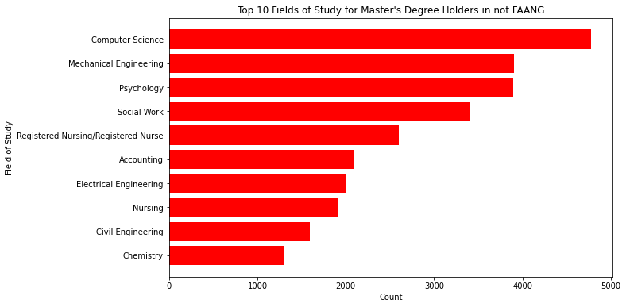
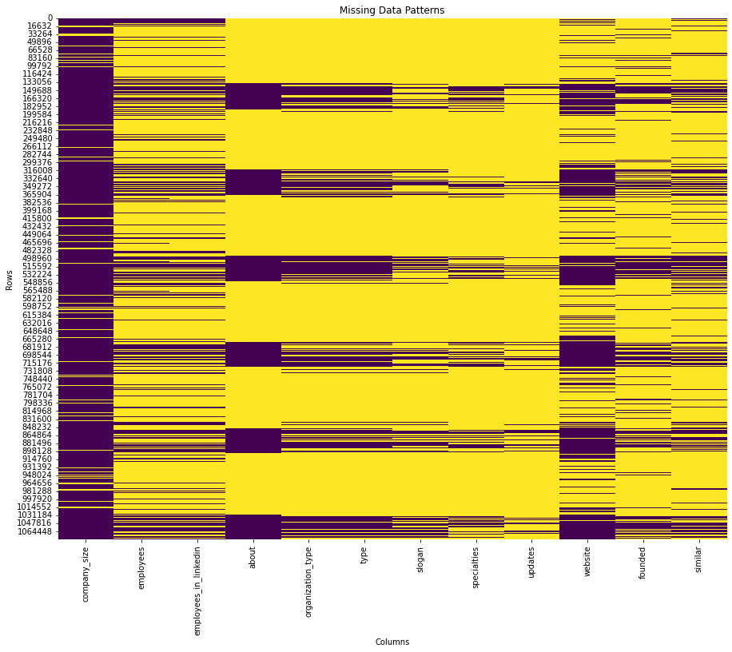
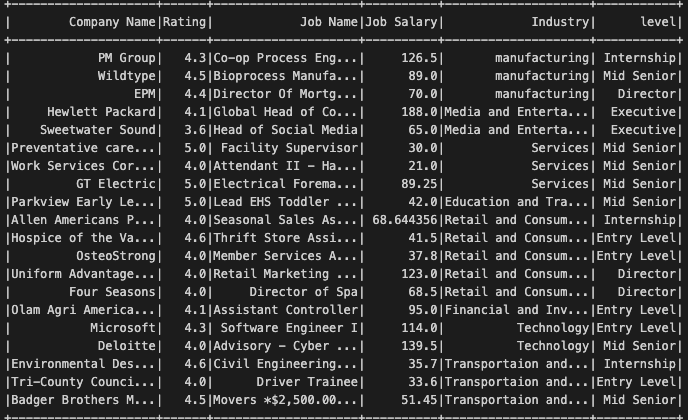

# Career Path with AI — Personalized, Data-Driven Career Planning

Predict optimal career trajectories from LinkedIn-style profiles using modern NLP (BERT embeddings), supervised classifiers, and unsupervised similarity matching over job market data (Glassdoor).

---

## What this project does :

- **Predicts** an individual’s industry and seniority from their profile text.
- **Recommends** a step-by-step career path (e.g., Internship → Entry → Mid → Senior → Director) tailored to profile attributes.
- **Matches profiles** to relevant job opportunities using vector similarity (Word2Vec + cosine) enriched with company rating & salary signals.

---

## Problem & Motivation

Navigating career growth is hard and noisy. We ask:
**Can AI infer where a person is today and recommend a credible, data-backed next step—up to a target seniority—using their profile plus live market signals?**

---

  <a href="scripts/CV_surg_pose_estimation.pdf"><b>📄 Read the Full Report (PDF)</b></a>

<table>
  <tr>
    <td></td>
    <td></td>
  </tr>
  <tr>
    <td></td>
    <td></td>
  </tr>
</table>

  

---

## Architecture

### Data Sources
- Profiles dataset (~80,000) for training & inference (LinkedIn-style schema).
- Glassdoor job listings (~4,867, US) scraped via Selenium + BeautifulSoup → cleaned Pandas DataFrame → CSV.

  

### NLP & Feature Engineering
- **BERT embeddings** on profile text fields (position, experience.description, education.field, about).

- Keyword extraction from position; word frequency over experience.description.

- Numeric features: years of **education & experience**.

- Categorical signals: **certifications**, **volunteer causes**.

### Models
- **Supervised:** Logistic Regression on BERT embeddings for industry & seniority classification (chosen after model bake-off).

- **Unsupervised:** Word2Vec + cosine similarity to match profile vectors ↔ job title vectors (re-ranked by company rating and salary, when available).

### Career Path Generator
- Stage-aware graph from current seniority to target (Director).
- Each hop is a vetted role suggestion matched by similarity + market signals.

---

## Data Analysis (EDA + Insights)

The full exploratory data analysis (EDA) lives in a companion repository:
LinkedIn Data Analysis → https://github.com/Ranykh/Linkedin-Data-Analysis

Two notebooks from that repo will also be added here for convenience:

- notebooks/Linkedin_dataAnalysis.ipynb

- notebooks/Linkedin_dataAnalysis_2.ipynb

### What we analyzed

- Keyword Identification (Position): Parsed position text for seniority/industry cues (e.g., “Intern”, “Junior”, “Senior”, “Data Analyst”, “ML Engineer”).

- Text Analysis (About/Experience): Topic & word-frequency exploration to reveal common responsibilities and skills; selective sentiment where useful.

- Statistical Profiling: Distributions of education years and experience years; outlier detection and sparsity checks.

- Experience Word Frequency: High-signal terms in experience.description (e.g., “SQL”, “Python”, “ETL”, “Transformers”, “A/B”).

- Volunteer Causes: Aggregated volunteer_experience.cause to capture personal interests that can correlate with industries.

- Certifications: Normalized certification names/taxonomy to feed categorical features.

### How the analysis informed modeling

- **Labeling & Features:** Position-based keywords helped validate seniority labels; EDA guided inclusion of education_years and experience_years.

- **Class Balance:** Identified skewed classes; informed sampling strategy and macro-/weighted-F1 reporting.

- **Text Fields to Keep:** Confirmed experience.description and education.field are most predictive; retained about for incremental lift.

- **Vocabulary Normalization:** Cleaned job titles & fields to improve Word2Vec and cosine similarity outcomes.

---

## Methodology Details

### Text Processing

- BERT embeddings for contextual understanding of profile text.

- Keyword/phrase parsing on position for domain/seniority hints.

- Topic/word frequency analysis on experience descriptions; selective sentiment where helpful.

### Feature Set

- Textual: BERT vectors, keyphrases, frequent terms.

- Numeric: years of education, years of experience.

- Categorical: certifications, volunteer causes, industries.

### Evaluation

- Per-class precision/recall/F1, macro/micro averages.

- Qualitative review of recommended career paths for plausibility & progression logic.

- Sensitivity to missing/partial profiles and outlier roles.

Observed outcome: Paths generated are credible for common roles and typical profiles; degrades gracefully with incomplete data but remains interpretable.

---

## Evaluation and Results - Expanded:

Our final algorithm has yielded promising results in line with our expectations. It generates a list comprising an optimal career path tailored for each individual based on various criteria such as their current position, seniority level, field of expertise, and the contents of their professional profile. Moreover, the algorithm operates dynamically, adjusting the career trajectory according to the individual's seniority level. For instance, when presented with a person at the "internship" seniority level, it constructs a career path extending to the highest echelon, namely "Director". 
We have observed that a significant proportion of these career paths are highly suitable and remarkably accurate. We are pleased with the outcomes, considering our time limits and resources.
As with any model, particularly within the realm of artificial intelligence, our algorithm exhibits limitations in accuracy. For instance, instances where individuals provide incomplete information may result in the prediction of career paths that are less than optimal or deviate from ideal roles. This outcome was anticipated given the reliance of our model on comprehensive data inputs for accurate predictions.
Furthermore, individuals occupying roles that are uncommon or considered outliers pose challenges to the model's predictive capabilities. Such cases may lead to deviations from expected outcomes, as these scenarios fall outside the scope of typical data patterns used for training the algorithm.
These examples underscore the inherent limitations of our model and highlight the need for continued refinement and adaptation to address diverse and nuanced scenarios within the realm of career prediction.

--- 

## Limitations and Reflection:
We faced several constraints that shaped our approach. Data collection was limited by BrightData quotas on Glassdoor, and our ramp-up on Selenium/BeautifulSoup led to early scraping errors. On the compute side, Azure resource limits and restricted library access ruled out heavy models, pushing us toward more efficient algorithms and optimizations. The LinkedIn dataset’s nested structure also required non-trivial preprocessing. Despite these challenges, disciplined planning, flexible problem-solving, and strong collaboration let us deliver a robust solution within time and resource limits.

--- 
## Conclusions:

In conclusion, we have successfully achieved our objective of developing a personalized career pathing solution, integrating a diverse range of algorithms. 
Our solution generated dynamic career paths tailored to LinkedIn profiles, aligning with their individual experiences and skillsets. 
We firmly believe that our model holds significant potential for future applications, given its foundation in well-established machine learning algorithms, predictive models, and data analysis techniques. 
Throughout this project, we explored various perspectives and disciplines, enriching our understanding of the interconnected fields that shaped our journey , and we saw that project planning is valuable for delivering high-quality outcomes. 
Moreover, this project has provided invaluable experience in navigating real-world challenges as data scientists, fostering collaboration and effective management within a diverse working environment.

**A glimpse of a our final results :**

---

## In order to run the notebook , you need to do the following :

1) You have to have your own API in order to do the web-scraping

**Note:** we kept the API string empty in the scraping section

2) You have to run the notebook in a Azure DataBricks enviornment

---

## Tech Stack
**Python, Pandas, scikit-learn, Transformers (BERT), Gensim (Word2Vec), Selenium + BeautifulSoup, Matplotlib.**

---

This repo demonstrates end-to-end ML: data collection, EDA, NLP feature engineering, modeling, evaluation, and a recommendation layer. The linked analysis repo shows analytical rigor and the notebook here shows modeling depth and design decisions.
